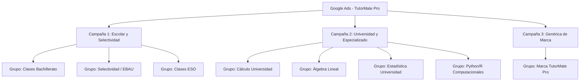

# Plan Estratégico de Google Ads - TutorMate Pro

Este documento define la planificación y estructura recomendada para lanzar campañas de publicidad de pago en **Google Ads** dirigidas exclusivamente al mercado español, enfocadas en la conversión directa sin desperdiciar presupuesto en clics no cualificados.

---

## 1. Estructura de Campañas Recomendada

Recomendamos estructurar la cuenta en **3 campañas de red de búsqueda**, separadas por intención de búsqueda y perfil de usuario. Esto permite asignar presupuestos independientes y controlar mejor la puja para cada tipo de cliente.

### Campaña 1: Escolar y Selectividad (ESO, Bachillerato, EBAU)
*   **Segmentación Geográfica:** España.
*   **Audiencia Objetivo:** Padres de alumnos (principalmente de 35 a 55 años) y alumnos de bachillerato (16 a 18 años).
*   **Estrategia de Puja:** Maximizar Clics (en fase inicial de aprendizaje) o Maximizar Conversiones (tras acumular al menos 15 conversiones mensuales).

### Campaña 2: Universidad y Especializado (Cálculo, Álgebra, Estadística, Software)
*   **Segmentación Geográfica:** España.
*   **Audiencia Objetivo:** Estudiantes universitarios (18 a 25 años) y adultos en formación avanzada.
*   **Estrategia de Puja:** Maximizar Clics con límite de CPC (Pujas manuales en palabras de alta competencia como cálculo/álgebra para evitar picos de CPC).

---

## 2. Grupos de Anuncios y Keywords (Convergencia y Concordancia)

Es fundamental segmentar las palabras clave para enviar al usuario a la landing page más relevante. Usamos concordancia **Exacta `[keyword]`** para captar búsquedas de alta intención y concordancia de **Frase `"keyword"`** para descubrir variaciones valiosas.

### Campaña 1 - Grupo: Selectividad / EBAU
*   **Página de destino:** `seo/preparacion-ebau-matematicas.html`
*   **Keywords:**
    *   `[preparacion ebau matematicas]`
    *   `[clases selectividad matematicas online]`
    *   `[profesor matematicas selectividad]`
    *   `"clases preparacion selectividad"`
    *   `"preparar ebau matematicas"`

### Campaña 1 - Grupo: Clases Bachillerato
*   **Página de destino:** `seo/clases-matematicas-bachillerato.html`
*   **Keywords:**
    *   `[clases particulares matematicas bachillerato]`
    *   `[profesor matematicas bachillerato online]`
    *   `"clases de matematicas bachillerato"`
    *   `"profesor particular bachillerato matematicas"`

### Campaña 2 - Grupo: Cálculo Universidad
*   **Página de destino:** `seo/clases-calculo-universidad.html`
*   **Keywords:**
    *   `[clases calculo universidad online]`
    *   `[profesor calculo infinitesimal]`
    *   `[clases particulares calculo 1]`
    *   `"clases calculo ingenieria"`
    *   `"profesor de calculo universidad"`

### Campaña 2 - Grupo: Álgebra Lineal
*   **Página de destino:** `seo/clases-algebra-lineal-universidad.html`
*   **Keywords:**
    *   `[clases algebra lineal online]`
    *   `[profesor algebra lineal universidad]`
    *   `"apoyo algebra lineal universidad"`
    *   `"clases particulares algebra lineal"`

### Campaña 2 - Grupo: Estadística Universidad
*   **Página de destino:** `seo/clases-estadistica-online.html`
*   **Keywords:**
    *   `[clases particulares estadistica online]`
    *   `[profesor estadistica universidad]`
    *   `"clases de estadistica universidad"`
    *   `"clases de probabilidad y estadistica"`

### Campaña 2 - Grupo: Python/R Computacionales
*   **Página de destino:** `seo/clases-matematicas-computacionales.html`
*   **Keywords:**
    *   `[clases python matematicas]`
    *   `[clases r estadistica]`
    *   `[practicas wolfram mathematica clases]`
    *   `"matematicas computacionales online"`

---

## 3. Keywords Negativas (Lista de Exclusión)

Para proteger el presupuesto diario, se debe implementar a nivel de cuenta una lista de palabras clave negativas para excluir tráfico basura y búsquedas de personas que no quieren o no pueden pagar el servicio:

*   **Gratis/Low-cost:** `gratis`, `gratuito`, `barato`, `economico`, `descuento`, `pdf gratis`, `descargar libro`, `ejercicios resueltos gratis`.
*   **Educación Formal/Oposiciones:** `colegio`, `instituto publico`, `temario oficial ministerio`, `oposiciones secundaria`, `oposiciones correos`, `pdf oposiciones`.
*   **Empleo/Búsqueda de trabajo:** `empleo`, `trabajo de profesor`, `enviar curriculum`, `ofertas de empleo`, `bolsa de trabajo`, `como dar clases en tutormate`.
*   **Plataformas de la competencia:** `superprof`, `gostudent`, `tusclasesparticulares`, `classgap`, `milanuncios`, `infoclases`.
*   **Resolución inmediata de exámenes:** `resolver examen en directo`, `hacer examen por mi`, `hacer chuletas`, `pagar por hacer examen`.

---

## 4. Ejemplos de Copys de Anuncios (RSA - Anuncios de Búsqueda Adaptables)

Ejemplo de estructura de anuncio enfocado en conversión para el Grupo **Selectividad / EBAU**:

### Títulos (Google alternará los mejores, máximo 30 caracteres)
1.  `Asegura tu EBAU Matemáticas II` (Pines obligatorios)
2.  `Clases de Matemáticas Online`
3.  `Profesor Particular de EBAU`
4.  `Simulacros y Exámenes Reales`
5.  `Prepara la Selectividad`
6.  `Clases Individuales 1:1`
7.  `Evita Bloqueos en Matemáticas`

### Descripciones (Máximo 90 caracteres)
1.  `Clases individuales con profesor matemático para preparar EBAU en España. Sin compromiso.`
2.  `Explicaciones paso a paso, simulacros cronometrados y resolución de exámenes oficiales.`
3.  `Analizamos las rúbricas de corrección para maximizar tu nota de acceso. Reserva valoración.`

---

## 5. Presupuesto Inicial Conservador

Recomendamos empezar con un presupuesto ajustado y controlado durante los primeros 30 días para verificar el funcionamiento de las conversiones antes de aumentar la inversión.

*   **Presupuesto Diario Campaña 1 (Escolar):** 10 € / día.
*   **Presupuesto Diario Campaña 2 (Universidad):** 10 € / día.
*   **Presupuesto Mensual Estimado:** 600 € / mes (aproximadamente 20 € diarios en total).
*   **Límite de CPC Máximo Inicial:** 1,20 € por clic (para evitar pujar demasiado alto en términos generales).

---

## 6. Criterios de Gestión: Pausar y Escalar

Para optimizar las campañas de forma objetiva, utilizaremos criterios métricos rigurosos:

### Criterios para PAUSAR campañas, grupos o palabras clave:
1.  **CPA (Coste por Adquisición) elevado:** Pausar cualquier palabra clave o anuncio que haya gastado más de **3 veces el coste objetivo de adquisición (CPA)** sin generar un envío de formulario o clic en calendario (ej. si el CPA ideal es 25 €, y una keyword gasta 75 € sin conversiones, se pausa).
2.  **Bajo CTR (Porcentaje de clics):** Si una palabra clave en concordancia de frase tiene un CTR inferior al **2.5%** después de 200 impresiones, se pausa por falta de relevancia.
3.  **Porcentaje de rebote / Tiempo en página bajo:** Si el tráfico de una campaña o palabra específica tiene una duración media de sesión inferior a **20 segundos** en Google Analytics, indica que la expectativa del anuncio no coincide con la landing.

### Criterios para ESCALAR campañas:
1.  **CPA estable:** Si la campaña mantiene un CPA por debajo del objetivo acordado (ej. menos de 20 € por cliente potencial) durante **2 semanas consecutivas** y el presupuesto diario se consume al 100%.
2.  **Cuota de impresiones perdida por presupuesto:** Si la campaña pierde más del **30% de cuota de impresiones** debido a la falta de presupuesto y la tasa de conversión es rentable, se incrementará el presupuesto diario en escalones de un **15% a 20% cada semana** para no romper el algoritmo de aprendizaje automático de Google.
